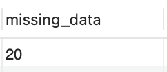
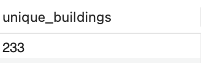
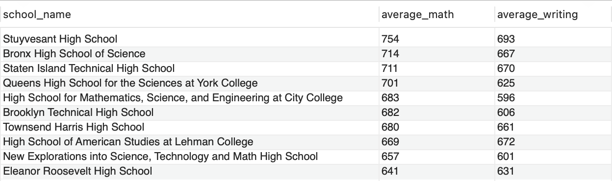
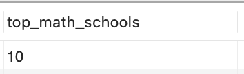
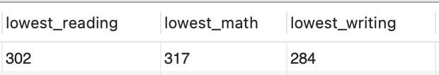
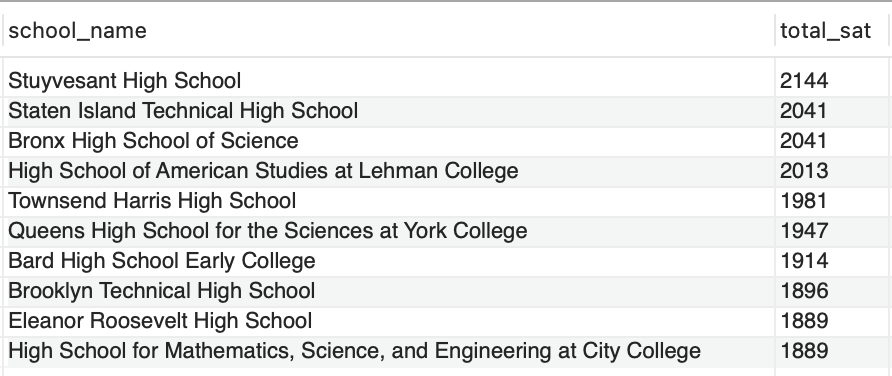
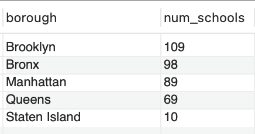
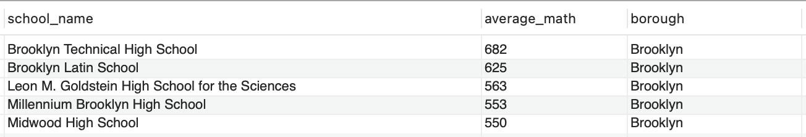

# Analysis of NYC Public School SAT Performance

This analysis examines SAT performance data across New York City's public high schools, revealing several interesting insights about academic achievement patterns in the city.

## Key Findings

1. **Data Completeness**:  

    

    > Out of 375 schools, only 20 (5%) are missing data on the percentage of students tested  

     
     

    > Many schools share buildings, with only 233 unique building codes for 375 schools  

2. **Top Performing Schools**:

    

   > **Stuyvesant High School** dominates in both math (754/800) and writing (693/800)

     
    

   > Only 10 schools have average math scores ≥640 (80% of maximum)

     
    

   > The lowest reading, math and writing scores were 302, 317 and 284 respectively.

3. **Overall SAT Performance**:

    

   > The top 4 schools all have average total SAT scores over 2000/2400
   - These elite schools are:
     - Stuyvesant High School (2144)
     - Staten Island Technical High School (2041)
     - Bronx High School of Science (2041)
     - High School of American Studies at Lehman College (2013)

4. **Borough Comparison**:

    

   > **Staten Island** leads in average SAT scores (1439) despite having only 10 schools
   - Performance by borough:
     1. Staten Island (1439)
     2. Queens (1345)
     3. Manhattan (1340)
     4. Brooklyn (1230)
     5. Bronx (1202)

5. **Brooklyn Highlights**:

    

   > Brooklyn has 109 schools, the highest then followed by the Bronx then Manhattan

     
    

   > Top math performers in Brooklyn:
     1. Brooklyn Technical High School (682)
     2. Brooklyn Latin School (625)
     3. Leon M. Goldstein High School for the Sciences (563)

## Observations

The data reveals significant disparities in academic performance across NYC schools. A small number of specialized high schools account for most of the top scores, while many schools struggle with much lower averages. The borough-level analysis shows that Staten Island, despite having far fewer schools, outperforms larger boroughs - this may warrant further investigation into factors like school funding, student demographics, or testing participation rates.

The concentration of high-performing schools in certain areas (particularly Manhattan and Staten Island) could have implications for educational equity and access to quality education across the city.
