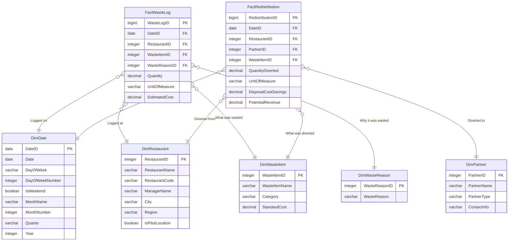

Here is a detailed data model designed for the **Power BI Dashboard** described in the realistic scenario for SavoryBites. This model is built for clarity, performance, and ease of use.

### **Data Model Overview**

We will use a **Star Schema**, which is ideal for Power BI and other analytics tools. It consists of one central fact table (containing the measurable events) surrounded by dimension tables (containing the descriptive attributes).

**Core Concept:** Every time waste is logged, it is a recorded event (a fact). That event has characteristics like *when* it happened, *where* it happened, *what* was wasted, and *why*.

### **Dimension Tables (The "Who, What, Where, When")**

These tables describe the business entities.

#### **1. DimDate**
*   **Purpose:** To analyze trends over time (daily, weekly, monthly, by weekday/weekend).
*   **Fields:**
    *   `DateID` (PK, Date, format: YYYY-MM-DD)
    *   `Date` (Full date)
    *   `DayOfWeek` (e.g., Monday)
    *   `DayOfWeekNumber`
    *   `IsWeekend` (True/False)
    *   `MonthName`
    *   `MonthNumber`
    *   `Quarter` (e.g., Q1)
    *   `Year`

#### **2. DimRestaurant**
*   **Purpose:** To analyze performance by location.
*   **Fields:**
    *   `RestaurantID` (PK, AutoNumber) - Surrogate key for the model.
    *   `RestaurantName` (e.g., "SavoryBites Downtown")
    *   `RestaurantCode` (Natural key from POS system, e.g., "SB-05")
    *   `ManagerName`
    *   `City`
    *   `Region`
    *   `IsPilotLocation` (True/False) - Flags locations in the animal feed or non-profit program.

#### **3. DimWasteItem**
*   **Purpose:** To categorize what was wasted. This is crucial for identifying problem items (like fries or bread).
*   **Fields:**
    *   `WasteItemID` (PK, AutoNumber)
    *   `WasteItemName` (e.g., "Russet Potatoes", "Brioche Buns", "Coleslaw Mix")
    *   `Category` (e.g., "Raw Ingredient", "Prepared Food", "Plate Waste") - From the log.
    *   `StandardCost` (Decimal) - The average cost per unit (e.g., per kg) for this item. This allows for more accurate cost calculation than the manual estimate.

#### **4. DimWasteReason**
*   **Purpose:** To understand the root cause of waste. This is key for implementing corrective actions.
*   **Fields:**
    *   `WasteReasonID` (PK, AutoNumber)
    *   `WasteReason` (e.g., "Over-Preparation", "Spoilage", "Customer Complaint", "Trim Waste")

#### **5. DimPartner** (For Phase 3 & 4)
*   **Purpose:** To track redistribution channels and partners.
*   **Fields:**
    *   `PartnerID` (PK, AutoNumber)
    *   `PartnerName` (e.g., "Green Valley Pig Farm", "City Homeless Shelter")
    *   `PartnerType` (e.g., "Compost", "Animal Feed", "Non-Profit", "Upcycler")
    *   `ContactInfo`
### **Fact Tables (The "What Happened")**

These tables record the measurable events.

#### **1. FactWasteLog** (The Core Table)
*   **Purpose:** To record every instance of wasted food.
*   **Fields:**
    *   `WasteLogID` (PK, BigInt) - A unique identifier for each log entry.
    *   `DateID` (FK to DimDate)
    *   `RestaurantID` (FK to DimRestaurant)
    *   `WasteItemID` (FK to DimWasteItem)
    *   `WasteReasonID` (FK to DimWasteReason)
    *   `Quantity` (Decimal) - The amount wasted.
    *   `UnitOfMeasure` (e.g., "kg", "lbs", "units") - Stored here for simplicity, though ideally standardized.
    *   `EstimatedCost` (Decimal) - The manually entered cost from the log. Can be compared to a calculated cost (`Quantity * StandardCost` from DimWasteItem) for data quality checks.

#### **2. FactRedistribution** (For Phase 3 & 4)
*   **Purpose:** To track successful diversion of waste from landfills, measuring the positive impact and cost savings.
*   **Fields:**
    *   `RedistributionID` (PK, BigInt)
    *   `DateID` (FK to DimDate)
    *   `RestaurantID` (FK to DimRestaurant)
    *   `PartnerID` (FK to DimPartner)
    *   `WasteItemID` (FK to DimWasteItem) - What was diverted.
    *   `QuantityDiverted` (Decimal) - The amount given to the partner.
    *   `UnitOfMeasure` (e.g., "kg")
    *   `DisposalCostSavings` (Decimal) - **Calculated as:** `QuantityDiverted * StandardDisposalCostPerUnit`. This is a key metric showing avoided cost (a form of revenue/recovery).
    *   `PotentialRevenue` (Decimal) - **Optional:** If waste is sold (e.g., citrus peels), the revenue generated.

### **Data Model Schema Diagram**

Below is a visual representation of how these tables relate to each other in a star schema.

### **How This Powers the Dashboard:**

*   **Total Waste Cost KPI:** Sum of `FactWasteLog[EstimatedCost]`.
*   **Waste by Reason:** Slice `FactWasteLog` by `DimWasteReason[WasteReason]`.
*   **Waste by Item:** Slice `FactWasteLog` by `DimWasteItem[WasteItemName]`.
*   **Trend Analysis:** Slice any fact table by `DimDate` fields (Year, Month, IsWeekend).
*   **Location Comparison:** Slice any fact table by `DimRestaurant`.
*   **Impact Metrics:** Sum of `FactRedistribution[QuantityDiverted]` and `FactRedistribution[DisposalCostSavings]`, filtered by `DimPartner[PartnerType]`.
*   **Leaderboard:** Rank `DimRestaurant[RestaurantName]` by the lowest sum of `FactWasteLog[EstimatedCost]`.

This model is scalable. When SavoryBites is ready for IoT integration, the `FactWasteLog` table would simply receive automated feeds from smart scales instead of manual Excel entries.
